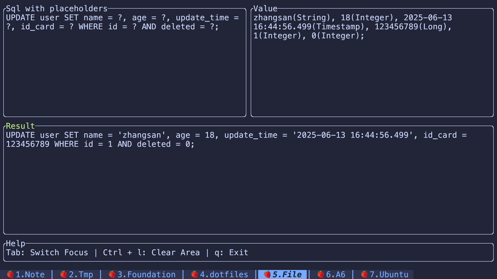

A tool for automatically replacing sql placeholders.



## Install

```bash
cargo install sql-param
```

## Usage

### Automatic mode

Simply copy the SQL log, then run the `sql-param` command. The program will automatically attempt to read the contents
of your system clipboard, extract the SQL with placeholders and the corresponding values, and populate them into the Sql
and Value areas of the TUI (you can modify them at any time). The Result area will display the final SQL with the
placeholders replaced, and the result will be copied to your system clipboard, so you can simply paste it anywhere using
Command+V(MacOS)/Ctrl+V(Linux or Windows).

Finally, you can exit the program at any time by pressing the `Esc` key.

Here is an example of a SQL log:

```log
iov-test-65759f684-pzpws iov-test 2025-06-28 20:18:06 --- [685fdd7ed0e3ea524bf29a38a05b72dc,0070d58fe48dd8f9] DEBUG 6 --- [  XNIO-1 task-6] c.a.model.test.yourbatis.Executor        : ==>  Preparing: SELECT * FROM user WHERE id = ? AND deleted = 0 and sex = ?;
iov-test-65759f684-pzpws iov-test 2025-06-28 20:18:06 --- [685fdd7ed0e3ea524bf29a38a05b72dc,0070d58fe48dd8f9] DEBUG 6 --- [  XNIO-1 task-6] c.a.model.test.yourbatis.Executor        : ==> Parameters: 1(Long), male(String)
iov-test-65759f684-pzpws iov-test 2025-06-28 20:18:06 --- [685fdd7ed0e3ea524bf29a38a05b72dc,0070d58fe48dd8f9] DEBUG 6 --- [  XNIO-1 task-6] c.a.model.test.business.Test    : ==> Update user info.
iov-test-65759f684-pzpws iov-test 2025-06-28 20:18:06 --- [685fdd7ed0e3ea524bf29a38a05b72dc,0070d58fe48dd8f9] DEBUG 6 --- [  XNIO-1 task-6] c.a.model.test.yourbatis.Executor        : ==>  Preparing: UPDATE user SET name = ?, age = ?, update_time = ?, id_card = ? WHERE id = ? AND deleted = ?;
iov-test-65759f684-pzpws iov-test 2025-06-28 20:18:06 --- [685fdd7ed0e3ea524bf29a38a05b72dc,0070d58fe48dd8f9] DEBUG 6 --- [  XNIO-1 task-6] c.a.model.test.yourbatis.Executor        : ==> Parameters: zhangsan(String), 18(Integer), 2025-06-13 16:44:56.499(Timestamp), 123456789(Long), 1(Integer), 0(Integer)
```

The result is:

```sql
SELECT * FROM user WHERE id = 1 AND deleted = 0 and sex = 'male';
UPDATE user SET name = 'zhangsan', age = 18, update_time = '2025-06-13 16:44:56.499', id_card = 123456789 WHERE id = 1 AND deleted = 0;
```

### Manual mode

Run the `sql-param` command to open the TUI interface.
First, enter the SQL statement with `?` placeholders. Then, use the mouse click or `Tab` key to switch focus and input
the corresponding values. Press `Tab` or mouse click again to view the final SQL result with placeholders automatically
replaced. The result is also automatically copied to the system clipboard.

Here is an example:

Sql with placeholders:

```code
UPDATE user SET name = ?, age = ?, update_time = ?, id_card = ? WHERE id = ? AND deleted = ?;
```

Value:

```code
zhangsan(String), 18(Integer), 2025-06-13 16:44:56.499(Timestamp), 123456789(Long), 1(Integer), 0(Integer)
```

Result

```code
UPDATE user SET name = 'zhangsan', age = 18, update_time = '2025-06-13 16:44:56.499', id_card = 123456789 WHERE id = 1 AND deleted = 0;
```