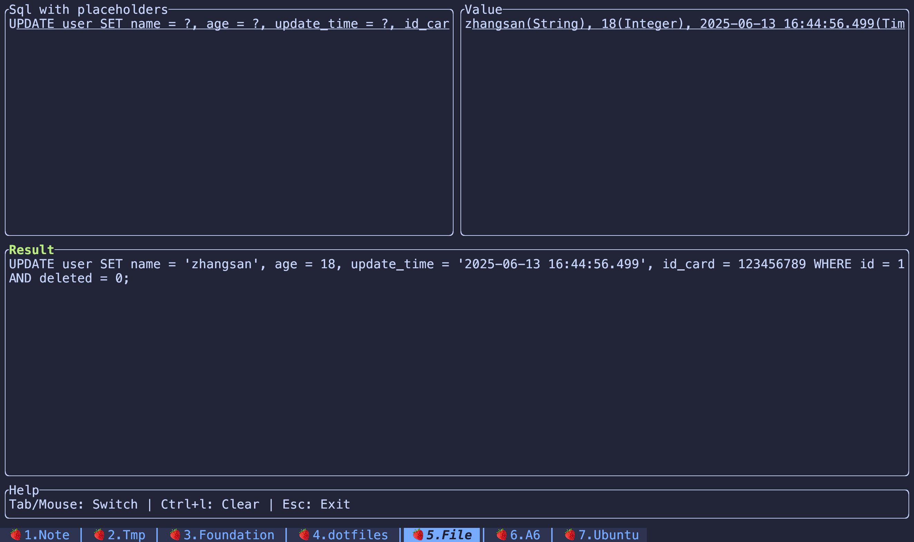

A tool for automatically replacing sql placeholders.



## Install

```bash
cargo install sql-param
```

## Usage

Simply run the `sql-param` command to open the TUI interface.
First, enter the SQL statement with `?` placeholders. Then, use the mouse click or `Tab` key to switch focus and input the corresponding
values. Press `Tab` or mouse click again to view the final SQL result with placeholders automatically replaced. The result is also
automatically copied to the system clipboard, so you can simply paste it anywhere using Command+V(MacOS)/Ctrl+V(Linux or Windows).
Finally, you can exit the program by pressing the `Esc` key.

Here is an example:

### Sql with placeholders

```code
UPDATE user SET name = ?, age = ?, update_time = ?, id_card = ? WHERE id = ? AND deleted = ?;
```

### Value

```code
zhangsan(String), 18(Integer), 2025-06-13 16:44:56.499(Timestamp), 123456789(Long), 1(Integer), 0(Integer);
```

### Result

```code
UPDATE user SET name = 'zhangsan', age = 18, update_time = '2025-06-13 16:44:56.499', id_card = 123456789 WHERE id = 1 AND deleted = 0;
```